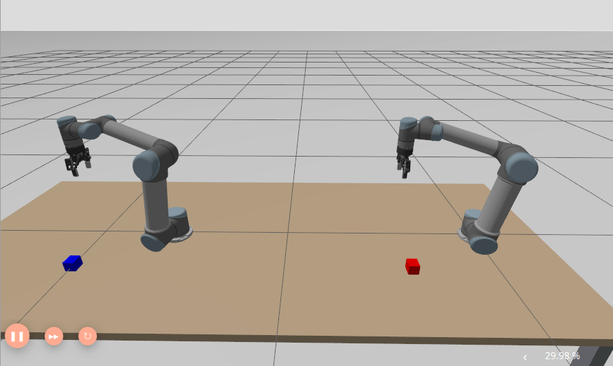
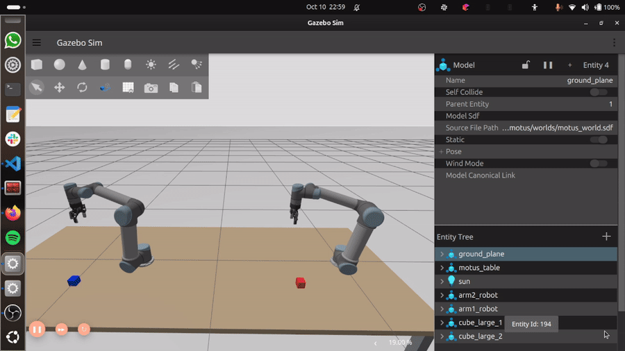
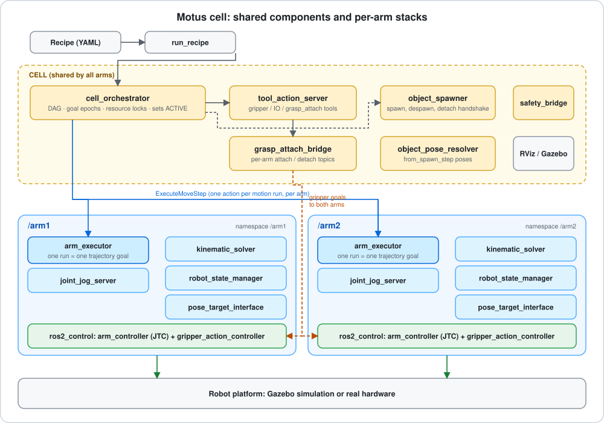
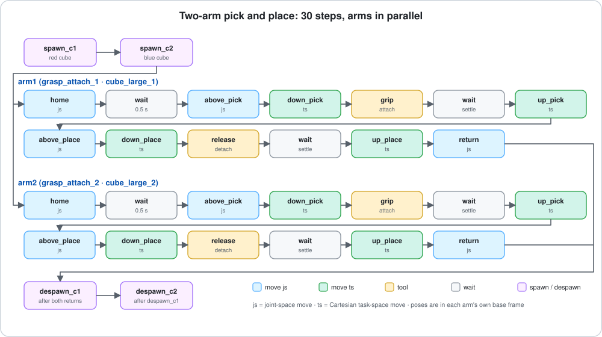
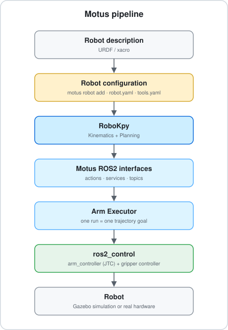
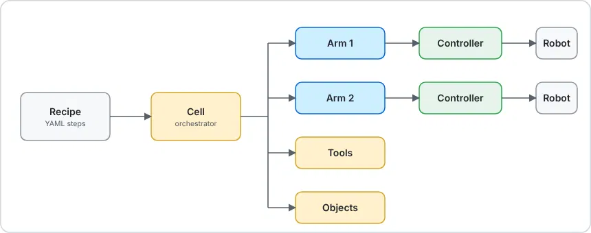

# Motus

**ROS2 framework for motion planning and control of serial robotic arms**

[](https://docs.ros.org/en/jazzy/) [](https://www.python.org/) [](https://gazebosim.org/) []()

<p align="center">
  
  <br><em>Two arms in one Motus cell (Gazebo simulation).</em>
</p>

<p align="center">
  
  <br><em>The two-arm pick-and-place recipe running end to end.</em>
</p>

Motus is a ROS2 framework for planning, simulating, and executing motion for serial robotic arms.

It is built on top of **RoboKpy**, which provides the underlying kinematics and trajectory generation.

The system is designed to work with different serial robot configurations rather than being tied to a particular robot manufacturer. Robot descriptions, joint configuration, controllers, and hardware interfaces are handled separately from the motion planning and orchestration layers.

Motus can be used with Gazebo simulation or real hardware, using the same planning and recipe interfaces in both cases.

---

## Contents

- [Synopsis](#synopsis)
- [Getting going](#getting-going)
- [Motus CLI: robot projects](#motus-cli-robot-projects)
- [Command reference](#command-reference)
- [Robot models](#robot-models)
- [Motion planning](#motion-planning)
- [Safe start and elbow-up posture](#safe-start-and-elbow-up-posture)
- [Tools and objects](#tools-and-objects)
- [ROS2 architecture](#ros2-architecture)
- [Recipes](#recipes)
- [System modes](#system-modes)
- [Simulation](#simulation)
- [Multi-arm cells](#multi-arm-cells)
- [Safety and manual control](#safety-and-manual-control)
- [Testing](#testing)
- [Troubleshooting](#troubleshooting)
- [Requirements](#requirements)
- [Known issues](#known-issues)
- [Contributing](#contributing)

## Synopsis

Motus provides ROS2 components for:

- Serial robot arm configuration
- A CLI (`motus`) that turns a manufacturer robot description into a ready-to-launch project
- Forward and inverse kinematics (RoboKpy or Pinocchio backends)
- Cartesian and joint-space motion planning
- MoveJ and MoveL motion
- Trajectory generation and waypoint blending
- Singularity-aware safe start and a consistent elbow-up posture
- Robot state and execution management
- Tool and I/O actions, including gripper attachment from a manufacturer description
- Object spawning and attachment in simulation
- Recipe-based task execution with offline validation
- Single-arm and multi-arm operation, with per-arm grasp tools so any arm can pick any object
- Automatic arm mode handling (ACTIVE before a recipe, optional PLANNER restore afterwards)
- Recipe cancel that releases held objects and despawns what the cell spawned
- Gazebo simulation and real hardware execution

The motion planning layer is provided by RoboKpy. Motus handles the ROS2 side of the system: nodes, interfaces, execution, controllers, tools, simulation, and coordination between multiple components.

The intention is to keep the robot model independent from the rest of the system. A serial arm can be introduced by providing the required robot description, joint configuration, controller interface, and planning parameters.

## Getting going

Motus is developed and tested with ROS2 Jazzy.

Clone the repository and build it as a normal ROS2 workspace:

```bash
git clone <this repo>

cd motus

colcon build

source install/setup.bash
```

### Using `just`

Common development and launch commands are provided through the `justfile`.

```bash
just single-arm-sim
just ps
```

Run:

```bash
just --list
```

to see the available commands.

## Motus CLI: robot projects

The `motus` command builds a project around a robot you already have a description for, without copying Motus itself. A project is a thin ROS2 package (URDF/xacro, meshes, `robot.yaml`, `controllers.yaml`, `tools.yaml`, launch wrapper, RViz config) that consumes the core Motus packages, so core improvements reach existing projects.

```bash
motus create project my_cell
cd my_cell

# import a robot description (any serial arm; --arg is forwarded to xacro)
motus robot add /path/to/Universal_Robots_ROS2_Description \
  --arg name=ur15 --arg ur_type=ur15 \
  --arg joint_limit_params=/path/to/config/ur15/joint_limits.yaml \
  --arg kinematics_params=/path/to/config/ur15/default_kinematics.yaml \
  --arg physical_params=/path/to/config/ur15/physical_parameters.yaml \
  --arg visual_params=/path/to/config/ur15/visual_parameters.yaml

# attach a gripper from its manufacturer description
motus tool add /path/to/robotiq_description --profile robotiq_2f_85 \
  --replace --align-approach --tcp-offset 0 0 0.145

motus doctor          # validate what is on disk, without changing anything
motus build           # doctor-gated colcon build of the project package
motus launch --sim    # or --real
```

<!-- <p align="center">
  
  <br><em>From a robot description to a running simulation with the `motus` CLI.</em>
</p> -->

| Command | What it does |
|---|---|
| `motus create project <name>` | Scaffold a project; `--from <path>` imports a robot in the same step |
| `motus robot add <path>` | Import or replace the robot description: parse, resolve resources, copy meshes, generate `robot.yaml` and `controllers.yaml`, and inject the `ros2_control` / Gazebo blocks the vendor URDF lacks |
| `motus tool add / list / remove` | Manage end-effectors. Tool config lives between `MOTUS-TOOL-BEGIN/END` markers; anything outside is yours |
| `motus world init / status / diff` | Give the project its own Gazebo world and `recipes/` folder, and compare it with the core world |
| `motus world table [--length L --width W --height H --center X Y --remove]` | Put the robot on a workbench: a static table whose top face is the `z = 0` plane (floor lowered by the table height), sized from the arm's reach unless given. Recipes and cube spawn heights work unchanged; run `motus build` afterwards |
| `motus doctor [--verbose]` | Check package layout, URDF parsing, mesh resources, link/joint names, config files and their types, and controller joint names |
| `motus build` | Run `doctor`, then `colcon build` the project (no `--symlink-install`) |
| `motus launch --sim / --real` | Source the parent workspace, then the project overlay, and launch the cell |

What the importer handles for you:

- **Any serial arm.** Joint chain, limits, and the TCP are derived from the description.
- **xacro arguments** are stored in `motus.json` and reused by `doctor`, `build`, and `launch`.
- **Mesh and YAML package references** are rewritten for the new package, including mesh paths embedded in vendor YAML files.
- **Missing pieces** are repaired: `ros2_control` and Gazebo plugin blocks are injected, and a massless root link gets a safe default only where Gazebo needs it.
- **Upright spawn pose.** The robot spawns upright and straight, clear of the floor, and `home_pose` in `robot.yaml` stays editable.
- **Ready pose.** A bent, well-conditioned `ready_pose` is written next to `home_pose` (see [Safe start](#safe-start-and-elbow-up-posture)).
- **Tool profiles.** `--profile robotiq_2f_85` supplies known gripper settings. They never override what the description itself says.

## Command reference

Every `motus` command, with an example. Run them from the project folder (the one that holds `motus.json`) unless noted. `motus --help` and `motus <command> --help` list the options.

### Project layout

`motus create project my_cell` produces a workspace with one thin ROS2 package:

```text
my_cell/
├── motus.json                 # what the CLI remembers: xacro args, tools, parent workspace
└── src/my_cell_motus/
    ├── config/                # robot.yaml, controllers.yaml, tools.yaml, objects.yaml,
    │                          #   cell_arms.yaml (multi-arm cells)
    ├── urdf/  meshes/         # the imported robot description
    ├── launch/                # my_cell.launch.py wrapper around the core cell launch
    ├── recipes/               # your recipes (after `motus world init`)
    └── worlds/                # your Gazebo world (after `motus world init`)
```

### `motus create project`

```bash
motus create project my_cell                                  # empty project in ./my_cell
motus create project my_cell --dest ~/robots                  # create it elsewhere
motus create project ur_cell --from /path/to/Universal_Robots_ROS2_Description \
  --arg ur_type=ur5e                                          # import a robot in the same step
```

`--arg NAME=VALUE` is forwarded to xacro (repeatable) and is ignored without `--from`.

### `motus robot add`

Imports or replaces the project's robot description. Everything it needs from the description is derived, so any serial arm works.

```bash
motus robot add /path/to/Universal_Robots_ROS2_Description \
  --arg name=ur5e --arg ur_type=ur5e \
  --arg joint_limit_params=/path/to/config/ur5e/joint_limits.yaml \
  --arg kinematics_params=/path/to/config/ur5e/default_kinematics.yaml \
  --arg physical_params=/path/to/config/ur5e/physical_parameters.yaml \
  --arg visual_params=/path/to/config/ur5e/visual_parameters.yaml
```

### `motus tool add | list | remove`

```bash
# a known gripper profile (Robotiq 2F-85), TCP 0.145 m out of the flange
motus tool add /path/to/robotiq_description --profile robotiq_2f_85 \
  --id gripper_1 --replace --align-approach --tcp-offset 0 0 0.145

# any xacro gripper macro, with the values you know
motus tool add /path/to/my_gripper_description --macro my_gripper \
  --mount tool0 --tcp-offset 0 0 0.12 --open 0.0 --closed 0.04 --max-effort 40 \
  --arg stroke=0.08

motus tool list                 # id, kind, mount link, driver joint and TCP link of each tool
motus tool remove gripper_1     # remove the tool and its managed config
```

`motus tool add` writes two entries in `tools.yaml`: the real gripper (`gripper_1`) and its simulation grasp sidekick (`grasp_attach_1`). The grasp tool carries `parent_model: arm1_robot`, the Gazebo model it welds objects to. After `--replace`, run `motus cell sync` so the extra arms' tools follow arm1's.

| Option | Meaning |
|---|---|
| `--profile` | Known tool settings, e.g. `robotiq_2f_85`. Never override what the description says |
| `--id` | Tool id used in recipes (default `gripper_1`) |
| `--macro`, `--mount`, `--tcp` | Xacro macro, link to mount on (default the arm's tip), TCP link |
| `--tcp-offset X Y Z` | Grasp point in the flange frame (metres, +Z out of the flange); creates a TCP frame if there is none |
| `--mount-rpy R P Y` | Rotate the tool on the mount (radians) |
| `--approach-offset` | Grasp height above the object centre |
| `--align-approach` | Rotate the tool so the fingertips point out of the flange |
| `--primary-joint`, `--open`, `--closed`, `--max-effort` | Driver joint and its limits |
| `--arg NAME=VALUE` | Macro parameter (repeatable) |
| `--replace` | Redo an existing tool of the same id |

### `motus world init | status | diff | table`

```bash
motus world init                    # copy the core world into the project and create recipes/
motus world init --force            # replace the project world (a .bak is kept)
motus world status                  # is the project world in sync with the core world?
motus world diff                    # show the differences

motus world table                              # workbench sized from the arm's reach
motus world table --length 3.0 --width 1.2     # explicit size (metres, along x and y)
motus world table --length 3.0 --center 1.1 0  # explicit centre
motus world table --height 0.8 --thickness 0.05
motus world table --remove                     # remove the table, restore the floor
```

The tabletop is the `z = 0` plane (the floor is lowered by the table height), so recipe heights do not change. By default the robot base sits 25 % of the length in from the back edge. For a multi-arm cell the default table spans every arm; for a long row of arms, set `--length` yourself. Run `motus build` after changing the world.

<!-- <p align="center">
  
  <br><em>`motus world table`: the tabletop is the z = 0 plane, so recipe heights do not change.</em>
</p> -->

### `motus cell add-arm | remove-arm | list | sync`

```bash
motus cell add-arm arm2 --x 1.6             # arm2: a copy of the project's robot, base at x = 1.6 m
motus cell add-arm arm3 --x 3.2 --y 0.0 --z 0.0
motus cell list                             # arms and their base poses
motus cell remove-arm arm3
motus cell sync                             # rebuild the extra arms' tools from arm1's
```

`add-arm` writes `config/cell_arms.yaml`, generates the extra arm's tools (`gripper_2`, `grasp_attach_2`, ...) with the right `parent_model` for that arm (`arm2_robot`), writes a starting recipe `recipes/multi_arm_example.yaml`, and wires the project's launch wrapper. It refuses bases closer than the robot's footprint and warns when the workspaces overlap (use a shared `resources:` lock, see [Recipes](#recipes)). `add-arm` does not resize an existing table: check the table covers the new arm (`motus world table --length ...`).

### `motus doctor | build | launch`

```bash
motus doctor --verbose     # validate the project on disk; changes nothing
motus build                # doctor, then colcon build the project package
motus launch --sim         # Gazebo simulation (default)
motus launch --real        # real hardware
```

### ROS-side commands

| Command | What it does |
|---|---|
| `ros2 run robokpy_controller run_recipe <recipe.yaml>` | Load and start a recipe: a path, or a file name found in the project's `recipes/`. The orchestrator sets the arms to ACTIVE itself |
| `ros2 run robokpy_controller run_recipe --cancel` | Stop the running recipe, release held objects, despawn spawned objects, return the cell to idle |
| `ros2 run robokpy_controller preflight_recipe --ros-args --params-file <robokpy_base.yaml> --params-file <robot.yaml> -p recipe_path:=<recipe.yaml>` | Validate a recipe without moving anything: compile, group runs, resolve poses, and plan every run with the real IK |
| `ros2 service call arm1/set_system_mode robokpy_interfaces/srv/SystemMode "{new_mode: 'ACTIVE'}"` | Set one arm's [system mode](#system-modes) by hand |
| `ros2 topic echo /arm2/joint_states --once` | Joint positions of one arm |
| `just single-arm-sim`, `just cell-sim-custom <arms.yaml>`, `just run-recipe <recipe> [arm]`, `just activate [arm]`, `just ps` | Shortcuts from the `justfile` (`just --list` shows all) |

## Robot models

Motus is not limited to UR-series robots.

The planning stack works with **serial robotic arms** described through the interfaces expected by RoboKpy and the ROS2 control stack.

A robot configuration generally consists of:

- Robot description / URDF
- Joint names and ordering
- Joint limits
- Kinematic parameters
- Controller configuration
- Spawn configuration for simulation
- Hardware interface for real operation

The robot-specific configuration is kept separate from the cell orchestration and recipe layers.

This makes it possible to use the same motion and execution infrastructure with different robot arms.

## Motion planning

RoboKpy provides the kinematic and trajectory-generation backend used by Motus.

Current motion functionality includes:

- Forward kinematics
- Inverse kinematics
- Jacobian calculation
- Joint-space trajectory generation
- Cartesian trajectory generation
- MoveJ
- MoveL
- LSPB trajectories
- Quintic trajectories
- S-curve trajectories
- TOPP-based Cartesian trajectories
- Joint and Cartesian limits
- Waypoint blending
- Pluggable IK backends: `robokpy` and `pinocchio` (`kinematic_solver_backend` / `ik_backend`)
- Automatic IK retry from fallback seeds when the primary seed fails
- Preferred-posture bias and joint-limit clamping for recipe planning

Motion segments can carry boundary velocity and acceleration information so that consecutive segments can be joined without unnecessarily stopping the robot at every waypoint.

The ROS2 layer receives the resulting trajectory and handles execution through the configured robot controller.

## Safe start and elbow-up posture

Robots spawn upright and fully stretched, which is a kinematic singularity. Seeding IK from a singular pose picks an arbitrary elbow/wrist branch, which shows up as sudden sweeps and elbow up/down flips. Motus avoids this in three layers:

1. **Singularity check.** `KinematicsFacade.min_singular_value()` is the smallest singular value of the length-scaled Jacobian, so one threshold (`singular_sigma_min`, default `0.05`) works for a 0.3 m desktop arm and a 1.3 m UR15 alike.
2. **Ready pose.** If a plan starts from a singular pose, the planner first adds a joint-space S-curve to a `ready_pose` (a bent, non-singular posture) and plans every leg from there. The ready pose is also the IK seed and posture bias while the home pose is singular.
3. **Elbow-up branch.** A ready pose must be elbow-up and reach in front of the base, because planning from an elbow-down pose collides with the base and table. `arm_executor` rejects a configured `ready_pose` on the wrong branch, warns, and derives a replacement.

<!-- <p align="center">
  
  <br><em>Singular start pose (left) and the ready pose the planner moves to first (right).</em>
</p> -->

Where the ready pose comes from:

- **The builder** writes `ready_pose` into `robot.yaml` for every robot it generates (`motus_cli/builder/safe_pose.py`).
- **The runtime** derives one at startup when `robot.yaml` has none and `home_pose` is singular (`robokpy_controller/ready_pose.py`). It logs the pose, its elbow height, forward reach, and `sigma_min`, so you can pin it in `robot.yaml`.
- The two searches share one design; keep them in sync when changing either.

A healthy, user-chosen `home_pose` keeps working exactly as before. The ready pose only takes over when `home_pose` is singular.

Related executor behaviour:

- A leading leg the arm is already at (for example `move_home` when re-running a recipe with the arm parked at home) is skipped instead of failing the run.
- Duplicate poses between recipe legs still abort, because they would collapse to zero-length segments and corrupt blending.

The checks are kinematic only (joint frames and tool above the floor). They do not check for collisions with your cell, so verify the ready pose before running on hardware.

## Tools and objects

### Tools

`tool_action_server` loads the tools in `tools.yaml` and exposes them to recipe `tool` steps. Backends:

| Backend | Use |
|---|---|
| `gripper_action` | Gripper via the ros2_control gripper action controller (mimic joints handled by the controller) |
| `gripper_position` / `gripper_effort` | Position- or effort-driven gripper joints |
| `digital_io` | GPIO outputs (pneumatic tools, relays) |
| `modbus` | Modbus TCP register writes (needs `pymodbus`) |
| `ros_topic` | Publishes to a hardware driver topic |
| `mock` | Stand-in when there is no hardware |
| `grasp_attach` | Simulation grasp: closes the gripper and welds the object to the gripper link |

Every `grasp_attach` tool names the arm it belongs to with `parent_model` (`arm1_robot`, `arm2_robot`, ...), because each arm has its own gripper link in Gazebo. `motus tool add` writes `parent_model: arm1_robot`, and `motus cell add-arm` rewrites it for each new arm. Without it the weld goes to whichever arm `objects.yaml` names (arm1), and the object sticks to the wrong gripper.

```yaml
grasp_attach_2:
  backend: grasp_attach
  parent_model: arm2_robot            # the arm this tool grasps with
  service_name: /grasp_attach
  action_name: arm2/gripper_action_controller/gripper_cmd
```

`grasp_attach` supports two mechanisms: `parallel_jaw` (closes to a width scaled to the object's size) and `suction`. Engage and disengage run in the background so the arm does not pause at each pick and place.

<!-- <p align="center">
  
  <br><em>`grasp_attach`: the gripper closes and the cube is welded to the gripper link.</em>
</p> -->

Gripper settings in `tools.yaml` use plain keys (`action_name`, `joint_name`, `open_position`, `closed_position`, `max_effort`, `action_timeout`, `min_close_ratio`). The older `gripper_`-prefixed spellings are still accepted.

### Objects

Objects are a catalog (`objects.yaml`) of types and instances. The pipeline is:

```text
objects.yaml + object_catalog
        │
        ▼
object_spawner  (Gazebo spawn / despawn, DetachableJoint handshake)
        │
        ▼
grasp_attach_bridge  ──►  object_pose_resolver
        │
        ▼
tool_action_server (grasp_attach)
```

Objects are handed out in spawn order: the first `cube_large` spawned is `cube_large_1`, the second `cube_large_2`, and a `tool` step grasps one by name (`command: "attach:cube_large_2"`). Every instance is welded to the arms at spawn, and the spawner detaches it again; it waits for the detach confirmation and re-sends the request up to four times before it logs an error.

Recipes can reference a spawned object's pose with `from_spawn_step`, optionally with `use_spawn_orientation`, so grasp poses follow where an object was actually spawned. The grasp approach offset comes from the catalog.

## ROS2 architecture

Motus is split into cell-level and arm-level components.

<p align="center">
  
  <br><em>Cell-level components (shared) and per-arm stacks (namespaced).</em>
</p>

### Cell

The cell layer contains components that are shared by the complete robot cell.

The main entry point is:

```text
cell.launch.py
```

It is responsible for components such as:

- Cell orchestrator
- Object management (spawner, pose resolver, grasp-attach bridge)
- Tool action server
- Safety bridge
- Named resource locks for cross-arm contention
- RViz
- Gazebo integration when simulation is enabled

### Arm

Each robot arm runs its own set of nodes under a ROS2 namespace.

The arm is configured through:

```text
arm.launch.py
```

The arm stack includes nodes such as:

```text
kinematic_solver
robot_state_manager
pose_target_interface
arm_executor
joint_jog_server
```

and the required controller interfaces. `arm_executor` plans a whole motion run in one call and sends it to the controller as a single trajectory goal, and `execution_monitor` confirms arrival from encoder state rather than relying on action results alone.

For a two-arm cell, the resulting ROS2 graph can be organized as:

```text
/arm1/...
/arm2/...
```

This keeps state, motion commands, controllers, and execution state isolated between arms.

### Launch configuration

The arms in a cell are defined in YAML, and that file belongs to **your project**, not to the core package. Create a multi-arm cell from a project folder:

```bash
motus cell add-arm arm2 --x 1.2     # adds arm2 (a copy of the project's robot) at x = 1.2 m
motus cell list
motus build && motus launch
```

This writes `config/cell_arms.yaml` (namespace and spawn pose per arm), generates each extra arm's tool entries (`gripper_2`, `grasp_attach_2`, ...) from arm1's, creates a starting recipe `recipes/multi_arm_example.yaml`, and makes the project's launch wrapper pass the file to the cell. The core `cell.launch.py` only reads an `arms_config` it is given; it ships no multi-arm example of its own.

## Recipes

Motus provides a YAML-based recipe interface for describing robot tasks.

A recipe can contain operations such as:

```text
MoveStep
ToolStep
IOStep
WaitStep
VisionStep
SpawnStep
```

For example:

```yaml
steps:
  - MoveStep
  - ToolStep
  - MoveStep
  - SpawnStep
  - MoveStep
```

The recipe is parsed and validated before execution. `preflight_recipe` runs the same compile, grouping, and pose-resolution steps without moving the robot, so structural mistakes and unreachable or duplicate poses are caught beforehand.

Motion steps are pose-only by design: there is no joint-target step, so continuity between legs is never broken by arbitrary joint configurations. Manual joint control lives in `joint_jog_server`, deliberately unreachable from recipes.

`Docs/motus_recipe_authoring_guid.MD` explains the step types, `js` vs `ts` trajectory methods, blending, and how to write a recipe that behaves as expected on the first try.

Motion steps are passed to the motion planning layer, while tool, I/O, and object operations are handled by their respective interfaces.

Consecutive motion steps can be blended into a continuous trajectory where the motion constraints allow it.

### Running recipes

```bash
ros2 run robokpy_controller run_recipe two_arm_pick_place.yaml
```

`run_recipe` loads the recipe and starts it. Before the first step the orchestrator sets every arm to `ACTIVE` (see [System modes](#system-modes)), so there is no manual mode call. Validate a recipe without moving anything with `preflight_recipe` (see the [command reference](#ros-side-commands)).

A recipe can be run again straight away; legs the arm is already at are skipped.

To stop a recipe part-way: the arm halts where it is, the gripper opens and any held object is detached, every object the cell spawned is despawned, and the cell returns to idle so a new recipe can be loaded:

```bash
ros2 run robokpy_controller run_recipe --cancel
```

or:

```bash
just run-recipe test0.yaml
```

### Recipe examples

A recipe is a flat list of steps. Each step has an `id`, a `type` and a `depends_on` list. Poses are in the **arm's own base frame**.

```yaml
recipe_id: single_pick
steps:
- id: spawn_c1                 # put a cube in the world
  type: spawn
  operation: spawn
  type_id: cube_large
  x: 0.40
  y: 0.25
  z: 0.03
  color: red
  depends_on: []

- id: home                     # joint-space move (js): smooth, may sweep
  type: move
  arm_id: arm1
  traj_method: js
  traj_type: scurve
  target_pose: {x: 0.425, y: 0.0, z: 0.383, qx: 1.0, qy: 0.0, qz: 0.0, qw: 0.0}
  depends_on: [spawn_c1]

- id: down                     # Cartesian move (ts): straight line, for approaches
  type: move
  arm_id: arm1
  traj_method: ts
  target_pose: {x: 0.40, y: 0.25, z: 0.0924, qx: 1.0, qy: 0.0, qz: 0.0, qw: 0.0}
  depends_on: [home]

- id: grip                     # weld the cube to this arm's gripper
  type: tool
  tool_id: grasp_attach_1
  command: "attach:cube_large_1"
  recovery: retry
  max_retries: 2
  depends_on: [down]

- id: settle
  type: wait
  duration_sec: 0.5
  depends_on: [grip]

- id: lift
  type: move
  arm_id: arm1
  traj_method: ts
  target_pose: {x: 0.40, y: 0.25, z: 0.3249, qx: 1.0, qy: 0.0, qz: 0.0, qw: 0.0}
  depends_on: [settle]

- id: drop
  type: tool
  tool_id: grasp_attach_1
  command: release
  depends_on: [lift]

- id: despawn_c1               # clean up
  type: spawn
  operation: despawn
  from_spawn_step: spawn_c1
  depends_on: [drop, spawn_c1]   # a despawn must list its spawn step
```

Rules that matter in practice:

- **Consecutive moves of one arm are planned as one run** and blended. A `wait` step breaks a run, so put one around every grasp and release.
- **A step that uses another step's result** (`from_spawn_step`) must list that step in `depends_on` as a plain, full-completion dependency.
- **`resources: [name]`** on a step takes a named lock while it runs; two arms share a zone by using the same name (see `recipes/multi_arm_example.yaml` after `motus cell add-arm`).
- **Move poses** use `traj_method: ts` for straight-line approach and retreat, and `js` (with `traj_type: scurve`) for long repositioning.
- **Progress dependencies** (`{progress: step_id, threshold: 0.85}`) start a step while the previous motion is still finishing, e.g. closing a gripper at the end of a descent.

The full guide, with the pitfalls, is in `Docs/motus_recipe_authoring_guid.MD`.

#### Two-arm pick and place

`Docs/examples/two_arm_pick_place.yaml` is a complete two-arm recipe: both arms home, pick their own cube, carry it across the table, release it, return home, and the cubes are despawned. The arms run in parallel and need no shared lock because each stays on its own side.

<p align="center">
  
  <br><em>The recipe as a step graph: the two arms run in parallel between the spawns and the despawns.</em>
</p>

```bash
motus cell add-arm arm2 --x 1.6              # second arm, 1.6 m along x
motus world table --length 3.0               # table long enough for both arms and their cubes
motus build
motus launch --sim
# in another terminal, from the project folder:
cp /path/to/motus/Docs/examples/two_arm_pick_place.yaml src/<project>_motus/recipes/
ros2 run robokpy_controller run_recipe two_arm_pick_place.yaml
```

Design rules behind it (they apply to every multi-arm recipe):

- **Put each arm's work in front of its own base.** Here `cube_large_1` is at world x = 0.40 for arm1 and `cube_large_2` at x = 2.00 for arm2, which is x = 0.40 in arm2's base frame, so both arms use the same poses. Targets behind a base force the IK onto an over-the-top branch (shoulder lift past -pi) with large shoulder-pan and wrist-3 swings, and the arm flails on the way back to home.
- **Check the table covers every cube**: arm2 at x = 1.6 with cubes at x = 2.0 needs a table that reaches about x = 2.1 m.
- **Spawn order fixes the instances.** `spawn_c1` is `cube_large_1`, `spawn_c2` is `cube_large_2`. Any arm can grasp any cube; the recipe just chooses which.
- **A despawn lists its spawn step** in `depends_on`.

<!-- <p align="center">
  
  <br><em>Targets behind the base (left) force an over-the-top configuration; work in front of each arm (right).</em>
</p> -->

## Simulation

Gazebo is used for physics simulation and hardware-independent development.

Start the default single-arm simulation with:

```bash
ros2 launch robokpy_controller cell.launch.py use_sim:=true
```

The simulation launch starts the configured robot, controllers, Gazebo world, Motus nodes, and RViz.

The same planning and recipe interfaces are used when running against real hardware. Simulation-specific nodes are enabled only when:

```text
use_sim:=true
```

is set.

This keeps the motion planning and task-level code independent from the simulation backend.

## Multi-arm cells

Motus supports multiple serial arms in the same ROS2 cell.

Each arm has its own namespace and execution stack, while the cell orchestrator handles tasks that involve shared resources.

For example:

```text
Cell
├── arm1
│   ├── kinematic_solver
│   ├── robot_state_manager
│   ├── pose_target_interface
│   └── arm_executor
│
├── arm2
│   ├── kinematic_solver
│   ├── robot_state_manager
│   ├── pose_target_interface
│   └── arm_executor
│
├── cell_orchestrator
├── tool_action_server
└── object_manager
```

The goal is to keep the arm implementation reusable while allowing the cell layer to coordinate multiple robots.

**Grasping with several arms.** In a multi-arm cell every arm gets its own set of Gazebo attach joints for every catalog object, so any arm can pick any object. Each arm has its own grasp tool: `grasp_attach_1` welds to `arm1`'s gripper and `grasp_attach_2` to `arm2`'s, through the tool's explicit `parent_model` (written by `motus tool add` / `motus cell add-arm`). An object held by one arm cannot be grasped by another until it is released.

Motion `target_pose` values are in the arm's own base frame, so for an arm mounted at world `x = 1.2` subtract 1.2 from a world x. `from_spawn_step` currently yields world coordinates and is only correct for an arm at the world origin. Your project's `recipes/multi_arm_example.yaml` (from `motus cell add-arm`) shows the layout; the arms take turns in a shared zone through a `shared_zone` resource.

## System modes

Each arm has a system mode. In `PLANNER` mode the arm publishes a *virtual* joint state (what interactive marker control plans against); in `ACTIVE` mode it publishes the real joint state, which recipes need.

- **Before a recipe starts**, the orchestrator sets every arm to `ACTIVE` and logs `[DAG] arms set to ACTIVE mode: ['arm1', 'arm2']`. An arm that cannot be reached or refuses is logged and left to the next layer.
- **Per run**, each `arm_executor` also makes sure its own arm is `ACTIVE` before it plans (`_ensure_active_mode`), so a run is safe even when started from somewhere other than `run_recipe`.
- **After a recipe**, arms stay `ACTIVE` by default. The orchestrator parameter `restore_planner_mode` (default `false`) switches the arms back to `PLANNER` when a recipe finishes, aborts or is cancelled, for setups that want interactive marker control back automatically. It is read once at start-up.

Set a mode by hand at any time:

```bash
ros2 service call arm1/set_system_mode robokpy_interfaces/srv/SystemMode "{new_mode: 'PLANNER'}"
ros2 service call arm2/set_system_mode robokpy_interfaces/srv/SystemMode "{new_mode: 'ACTIVE'}"
```

## Safety and manual control

- **`safety_bridge`** republishes the cell's safety signal as `/safety_state` for the orchestrator. It is read-only with respect to safety and currently uses a **placeholder** hardware read; wire it to real safety I/O before using real hardware.
- **`joint_jog_server`** provides direct manual joint control (calibration, teaching, override), outside the recipe DAG.
- **`resource_lock`** is a plain named mutex for shared zones or tools between arms.
- **Vision** steps are a foundation only; there is no production vision backend yet.

## Testing

The unit tests run without ROS (the ROS modules are stubbed):

```bash
# CLI: project scaffolding, tools, cell arms, world table, safe pose
cd motus_cli && python3 -m pytest -q tests

# controller: cancel, active-mode guard, multi-arm grasp wiring
cd src/robokpy_controller
PYTHONPATH=../robokpy python3 -m pytest -q \
  test/test_cancel_recipe.py test/test_active_mode_guard.py test/test_multi_arm_grasp.py
```

`motus_cli/tests/test_tool_add.py::test_unbuilt_vendor_package_with_find_is_resolved` needs `ament_index_python`, so it only passes in a sourced ROS environment.

## Troubleshooting

| Symptom | Cause and fix |
|---|---|
| Both cubes attach to arm1 | A `grasp_attach_N` tool lacks `parent_model: armN_robot`. Add it, or re-run `motus cell sync` |
| `"cube_large_2" belongs to arm ...` | An old build with one owner arm per cube. Any arm can grasp any cube now; update `robokpy_controller` |
| `... already held by arm armX` | The cube is still welded to another arm: release it first |
| An arm swings into an awkward pose after placing | Its targets are behind the base. Move the work in front of the arm (see [Two-arm pick and place](#two-arm-pick-and-place)); check with `preflight_recipe` |
| `IK failure along blended path` | A pose is unreachable from the previous one. Run `preflight_recipe`, shorten the move, or add an intermediate pose |
| `no attach confirmation from DetachableJoint` | The spawner could not detach the cube at spawn. It retries; if it persists, restart the launch cleanly (below) |
| Gazebo never comes up, `spawn_robot` loops on `Requesting list of world names` | Leftover processes from an earlier run |
| Recipe load fails: `has from_spawn_step=... but does not list it` | Add the spawn step to the despawn's `depends_on` |

Stop a launch with **Ctrl+C**. `Ctrl+Z` only suspends it and leaves Gazebo and ROS running. To clean up after a bad stop:

```bash
pkill -9 -f "gz sim"; pkill -9 -f ros2; ros2 daemon stop
```

Useful checks:

```bash
gz topic -i -t /grasp_attach/arm2/cube_large_2/attach   # who publishes / subscribes
grep -n "parent_model" src/<project>_motus/config/tools.yaml
ls /tmp/robot_sim_gz_arm*.urdf                          # the URDF each arm was spawned from
```

## Requirements

| Dependency | Version | Notes |
|---|---|---|
| ROS2 | Jazzy | Development and test platform |
| Python | 3.12 | Required runtime |
| Gazebo Sim | 8.x | Required for simulation |
| `xacro` | ROS2-provided | Robot description processing |
| `ros_gz_sim` | ROS2-provided | Gazebo integration |
| `ros_gz_bridge` | ROS2-provided | ROS2/Gazebo communication |
| `ros2_control` | ROS2-provided | Robot control interface |
| `controller_manager` | ROS2-provided | Controller management |
| `tf2_ros` | ROS2-provided | Transform handling |
| RoboKpy | Bundled | Kinematics and trajectory generation |
| Pinocchio (`pin`) | Optional | Alternative IK backend |
| `colcon`, `just` | Optional | `motus build` uses `colcon`; `just` runs common launch commands |

Gazebo and the `ros_gz_*` packages are not required when running against real hardware.

## Example workflow

A typical development workflow is:

<p align="center"></p>

For a complete cell:

<p align="center"></p>


## Known issues

Current implementation notes and operational issues are maintained in:

```text
RUNBOOK.md
```

This includes information about:

- ROS2 namespaces
- TF configuration
- Controller behaviour
- DDS communication
- Gazebo issues
- Hardware integration
- Current development work

The RUNBOOK is intended to be the operational reference for the project.

## Contributing

Motus is under active development.

If you are working on the project, start with:

```bash
just single-arm-sim
```

and verify the basic simulation before changing the planning or orchestration layers.

For larger changes, open an issue or pull request so the proposed change can be discussed before restructuring an existing subsystem.

---

## Related projects

**RoboKpy**

RoboKpy is the kinematics and trajectory-generation library used by Motus.

Motus provides the ROS2 integration and execution layer around it.

## License

Motus is released under the [MIT License](LICENSE).
